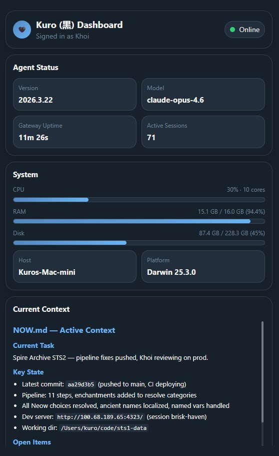

# openclaw-miniapp

A lightweight Telegram Mini App dashboard for [OpenClaw](https://github.com/openclaw/openclaw) agents. Tap the menu button in your bot's chat to see agent status, system health, workspace context, and recent activity — all in one glance.

Zero dependencies. No build step. ~350 lines total.



## Features

- **Agent Status** — version, model, gateway uptime, active sessions, online/offline indicator
- **System Stats** — CPU, RAM, disk usage with progress bars; hostname and platform
- **GPU Monitoring** — auto-detected via `nvidia-smi` (NVIDIA) or `rocm-smi` (AMD); hidden when no GPU is present
- **Current Context** — renders your agent's `NOW.md` with inline markdown (headers, lists, checkboxes, bold, code)
- **Recent Activity** — last 10 sessions with model, token count, and time since last activity
- **Agent Identity** — reads name and emoji from `IDENTITY.md` (falls back to "OpenClaw")
- **Telegram Native** — inherits dark/light theme automatically, signed-in user shown in header
- **Secure** — Telegram `initData` HMAC-SHA256 validation + user ID allowlist

## How It Works

```
Telegram Mini App → HTTPS (reverse proxy) → Node server (:3001) → local file reads + HTTP ping
```

The server reads data directly from OpenClaw's workspace and session files — no CLI calls in the hot path. Gateway health is checked with a quick HTTP ping to `/healthz`. Loads in under 100ms.

## Setup

### 1. Clone and configure

```bash
git clone https://github.com/nkhoit/openclaw-miniapp.git
cd openclaw-miniapp
cp .env.example .env
```

Edit `.env`:

```env
BOT_TOKEN=123456:ABC-DEF          # Telegram bot token (from @BotFather)
WORKSPACE=/path/to/.openclaw/workspace-main
ALLOWED_USER_IDS=123456789        # Comma-separated Telegram user IDs
PORT=3001
```

### 2. Start the server

```bash
node server.js
```

For persistence, run as a systemd service (Linux) or launchd agent (macOS).

### 3. Expose via HTTPS

Telegram requires HTTPS for Mini Apps. Pick one:

**Tailscale Serve** (recommended — tailnet-only, no public exposure):
```bash
tailscale serve --set-path /dashboard/ 3001
```
Only devices on your Tailscale network can reach it. Since the Telegram Mini App loads in your phone's webview (not on Telegram's servers), this works as long as your phone has Tailscale installed. Best option for personal use — zero public attack surface.

**Tailscale Funnel** (public internet):
```bash
tailscale funnel --set-path /dashboard/ 3001
```
Exposes the dashboard to the public internet via Tailscale's edge. Use this if you need access from devices not on your tailnet.

**Cloudflare Tunnel**:
```bash
cloudflared tunnel route dns your-tunnel dashboard.yourdomain.com
```

**nginx + Let's Encrypt**:
```nginx
location /dashboard/ {
    proxy_pass http://127.0.0.1:3001/;
}
```

### 4. Register with BotFather

1. Open **@BotFather** in Telegram
2. `/setmenubutton` → select your bot
3. Enter your HTTPS URL (e.g., `https://your-host.ts.net/dashboard/`)
4. Enter a label (e.g., `Dashboard`)
5. Open the bot chat → tap the menu button

## Security

1. **Telegram `initData` HMAC-SHA256** — every request is cryptographically signed by Telegram. The server validates using your bot token. Invalid → 401.
2. **User ID allowlist** — only configured Telegram user IDs are accepted. Others → 403.
3. **Read-only** — no write endpoints, no mutations.

## Customization

### Agent Identity

Create `IDENTITY.md` in your OpenClaw workspace:

```markdown
- **Name:** YourAgent
- **Emoji:** 🤖
```

The dashboard will show your agent's name and emoji in the header.

### Adding Widgets

The dashboard is a single HTML file. To add a widget:

1. Add an API endpoint in `server.js`
2. Add a `<section class="card">` in `public/index.html`
3. Add a fetch call in the refresh function

### Widget Ideas

- Home Assistant device states
- Camera snapshots (Frigate)
- CI/CD build status
- Calendar events
- Task list from workspace files

## Tech

- **Frontend**: Single `index.html` with inline CSS/JS (~200 lines)
- **Backend**: Node.js HTTP server, zero dependencies (~250 lines)
- **Auth**: Telegram WebApp initData HMAC-SHA256
- **Markdown**: Inline parser (headers, lists, checkboxes, bold, code)
- **GPU**: Optional, auto-detected via `nvidia-smi` / `rocm-smi`

## License

MIT
